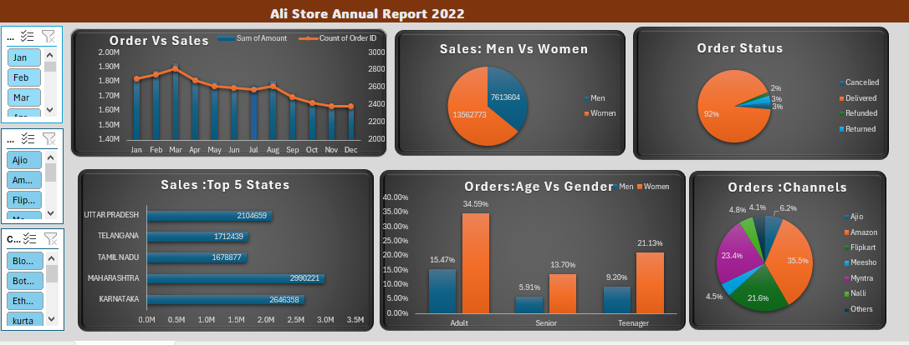

# 📊 Excel Sales Dashboard Project

## 📁 Project Overview

This project is an interactive **Sales Dashboard built in Microsoft Excel**, designed to visually represent sales performance across regions, months, and categories. It helps in quickly analyzing trends and making data-driven decisions.

## 🛠️ Tools & Features Used

- **Microsoft Excel**
- Pivot Tables
- Pivot Charts
- Slicers (for dynamic filtering)
- Conditional Formatting
- Drop-down Lists
- Interactive KPIs

## 🧾 Dataset Description

The dataset contains fictional sales records, including:
- Order Date
- Region
- Category
- Sub-Category
- Salesperson (Ali)
- Sales & Quantity

> 📌 *Note: This data is for practice/demo purposes and does not represent real-world sales.*

## 💡 Key Insights from the Dashboard

- **Monthly Sales Trend** across different regions
- **Top Performing Salesperson**
- Category-wise and region-wise performance breakdown
- Visual filters to dynamically analyze any subset of data

## 📸 Dashboard Preview

## 📂 Project Structure

📁 Excel-Sales-Dashboard/
┣ 📄 README.md
┣ 📄 Sales_Dashboard.xlsx
┣ 📄 sales_data.csv
┣ 📁 images/
┃ ┗ dashboard_preview.png

## 🎯 Learning Outcome

Through this project, I practiced:
- Data cleaning and structuring in Excel
- Creating interactive dashboards with slicers and pivot tables
- Designing a user-friendly layout for business users

## 📬 Contact

Feel free to connect with me for feedback or collaboration:  
👩‍💼 **Madiha Lodhi**  
🔗 [LinkedIn](https://www.linkedin.com/in/madiha-data-analyst)  
📧 madihalodhi1717@gmail.com

